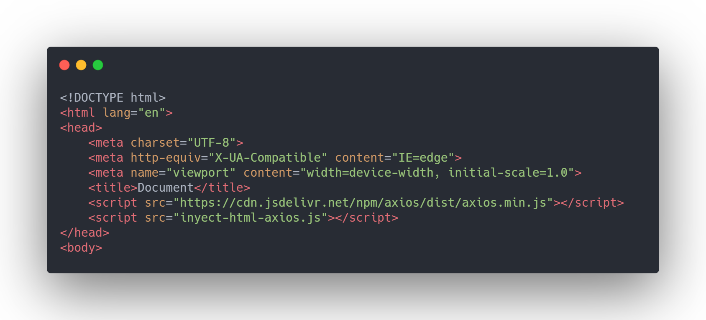
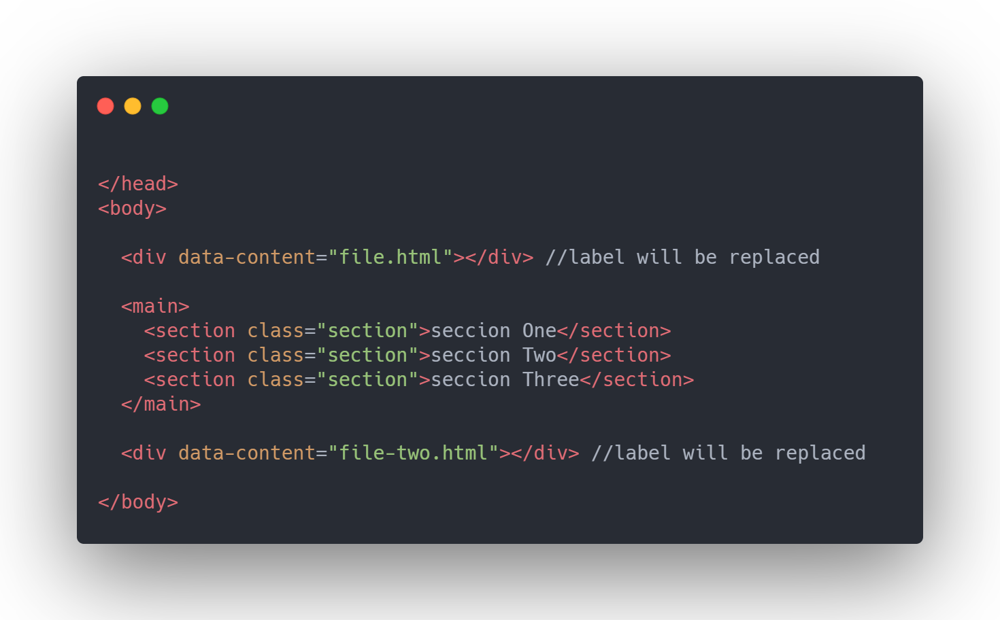
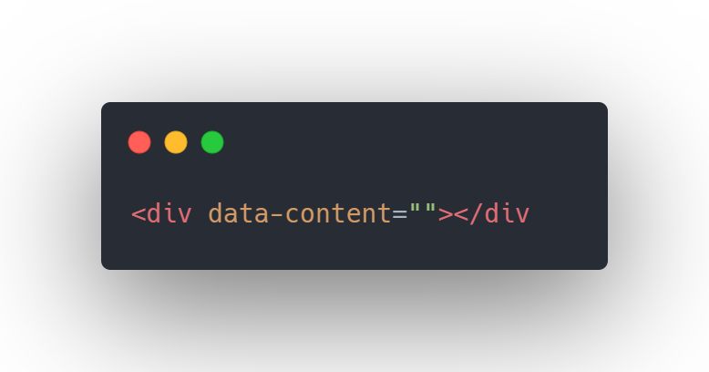
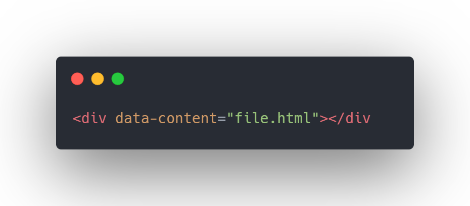

# What is it 
This is a small 'Library' that will help you to bring html code from other parts since it is usually very tedious to be repeating lines of code
this functional library with axios.

## Requirements 
### 1.Import the scripts in the header
  
### 2.have html tags these tags will be replaced by the html code you want to import  
  
### 3.these tags have to have the 'data-attribute',' data-content= "" '  
  
### 4.inside the url of the file you want to import for example ' data-content = "header.html" '  
  
 
